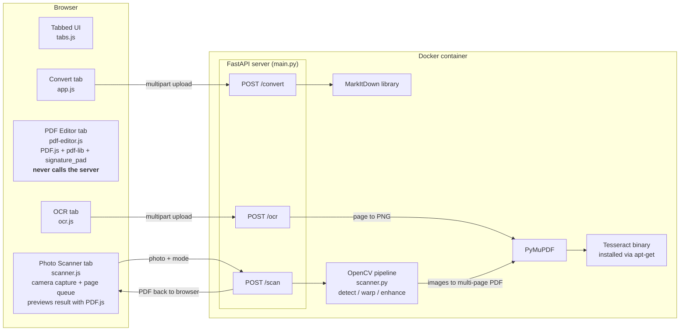

# MarkItDown Toolbox

A small FastAPI web app that puts four document tools on one tabbed page: convert almost any file to Markdown, edit and sign PDFs entirely in your browser, pull text out of scanned PDFs with OCR, and turn phone photos of documents into clean scanned PDFs. It is also a compact lesson in how real document tooling works — where the browser is enough, where you need a server, and where you need a whole Docker container.

## Features

- **Convert to Markdown** — upload a PDF, DOCX, PPTX, XLSX, HTML, CSV, JSON, image, and more; the server runs it through [Microsoft's MarkItDown](https://github.com/microsoft/markitdown) library and hands back a `.md` file download.
- **PDF Editor** — add text boxes, whiteout rectangles, and a hand-drawn signature to any PDF. 100% client-side: your PDF never leaves your machine. Rendered with PDF.js, edited on an overlay, exported with pdf-lib.
- **OCR Scanner** — upload a scanned PDF (up to 20 MB / 20 pages); the server renders each page to an image with PyMuPDF and extracts text with Tesseract, returning Markdown you can copy or download.
- **Photo Scanner** — add pages by uploading photos **or capturing them live from your camera** (like CamScanner), build a multi-page queue you can reorder and trim, then let the server run the classic OpenCV pipeline on each page — find the corners, flatten the perspective, enhance in color, grayscale, or black & white — and combine them into one multi-page PDF you preview in-browser before downloading.

## Architecture at a glance

Three of the four tools talk to the server. The PDF editor never does — that's the interesting part.



Why Docker around the whole server? Tesseract is a compiled system program, not a Python package — more on that in the lesson below.

## How it works — a lesson

### 1. Why you can't truly edit PDF text

A PDF is not a word processor document. It doesn't store paragraphs; it stores drawing instructions: "place these glyphs at these exact coordinates in this font." There's no concept of "the sentence continues here" — so there's nothing to reflow when you change a word. That's why the editor doesn't even try.

Instead it does what many commercial PDF tools quietly do too: **cover and replace**. You drag a white **Whiteout** rectangle over the old text, then click **Add Text** to type the replacement on top. At export time, `pdf-editor.js` uses pdf-lib to draw the white rectangle and the new text as *new* drawing instructions layered over the originals. The old text is hidden, not removed (keep that in mind for anything sensitive — it's still in the file).

### 2. The coordinate-system gotcha

The editor juggles two coordinate systems that disagree about almost everything:

| | Canvas (browser) | PDF |
|---|---|---|
| Origin | **top**-left | **bottom**-left |
| Y grows | downward | upward |
| Units | CSS pixels (at a render `scale`) | points (1/72 inch) |

Every edit is stored in canvas pixels while you work, then converted exactly once at export. All the conversion lives in one tiny helper in `static/js/pdf-editor.js`:

```js
/**
 * Canvas px (top-left origin, y down) -> PDF points (bottom-left origin, y up).
 */
function toPdfCoords(xPx, yPx, page, scale) {
    const { height } = page.getSize(); // points
    return { x: xPx / scale, y: height - yPx / scale };
}
```

Two things happen here:

- **Scale division** (`xPx / scale`): PDF.js rendered the page zoomed by `scale` to fit your screen, so pixel measurements are `scale` times too big. Dividing converts pixels back to PDF points.
- **The y-flip** (`height - yPx / scale`): a point 50px from the *top* of the canvas is `pageHeight - 50/scale` points from the *bottom* of the PDF page. Subtracting from the page height flips the axis.

Keeping this in exactly one function is the design lesson: if placement is ever off, there's one place to look. (One extra wrinkle: pdf-lib anchors rectangles and images at their *bottom*-left corner, so the export code also shifts `y` down by the element's height.)

### 3. Why OCR forces Docker

`pip install` can only install Python packages. Tesseract is a compiled C++ program that lives in your operating system, not in your Python environment — `pytesseract` (in `requirements.txt`) is just a thin wrapper that shells out to the `tesseract` binary and fails if it isn't there.

On Render's native Python runtime you can't run `apt-get` to install system programs. So the project ships a `Dockerfile` that builds its own miniature operating system with Tesseract baked in:

```dockerfile
RUN apt-get update \
    && apt-get install -y --no-install-recommends tesseract-ocr tesseract-ocr-eng \
    && rm -rf /var/lib/apt/lists/*
```

Memory shapes the rest of the design. Render's free tier gives you **512 MB of RAM**, and rendering PDF pages to images is memory-hungry. So `main.py` defines three constants at the top of its OCR section:

```python
OCR_MAX_BYTES = 20 * 1024 * 1024   # 20 MB upload limit
OCR_MAX_PAGES = 20
OCR_DPI = 150                      # 150 DPI is plenty for Tesseract
```

The OCR loop processes **one page at a time** and deletes each image before rendering the next, so peak memory stays at roughly one page regardless of document length. 150 DPI is a deliberate compromise: sharp enough for Tesseract, a quarter of the memory of 300 DPI. On a bigger machine, bump these constants.

One more detail worth stealing: the `/ocr` route is a plain `def`, not `async def` — on purpose. FastAPI runs sync routes in a worker thread, so the CPU-heavy OCR work never blocks the event loop that serves everyone else. (The `/scan` route below uses the same trick, for the same reason.)

### 4. How the photo scanner "sees" a page

`scanner.py` is the classic computer-vision document-scanning pipeline, written as four small stages: **DETECT → WARP → ENHANCE → EXPORT**. Every phone scanning app you've used does some version of this.

**DETECT — find the four corners.** Before looking for anything, the photo is downscaled to at most 1000px. That sounds backwards — surely more pixels means better detection? No: edge detection cares about the page's *outline*, not its text, and a smaller image is both faster and *more robust* because fine detail (text, wood grain, shadows) shrinks into irrelevance. Then the classic recipe:

```python
# Classic recipe: grayscale -> blur (kill noise) -> Canny (find edges)
# -> dilate (bridge small gaps so the page outline closes into a loop).
gray = cv2.cvtColor(small, cv2.COLOR_BGR2GRAY)
gray = cv2.GaussianBlur(gray, (5, 5), 0)
edges = cv2.Canny(gray, 50, 150)
edges = cv2.dilate(edges, np.ones((3, 3), np.uint8), iterations=2)
```

Each step exists to fix a failure mode of the next one. Blur first, because Canny would otherwise report every speck of noise as an edge. Dilate (thicken) the edges afterward, because a page outline with even a one-pixel gap won't close into a loop — and `findContours` can only find shapes whose outlines close. Finally, `approxPolyDP` simplifies each candidate contour; the code keeps the first one that reduces to **exactly 4 corners** and covers **at least 20% of the photo** (anything smaller is probably a sticker or a window, not the page).

If no quad passes both tests, the pipeline doesn't fail — it enhances the full photo instead, and the `X-Scan-Detected` response header tells the frontend which path happened so `scanner.js` can show the right toast.

**WARP — flatten the perspective.** The four detected corners arrive in arbitrary order, but the transform needs them as top-left, top-right, bottom-right, bottom-left. The sum/diff trick sorts them without any angle math:

```python
sums = pts.sum(axis=1)
diffs = np.diff(pts, axis=1).ravel()
return np.array(
    [
        pts[np.argmin(sums)],   # top-left
        pts[np.argmin(diffs)],  # top-right
        pts[np.argmax(sums)],   # bottom-right
        pts[np.argmax(diffs)],  # bottom-left
    ],
    dtype=np.float32,
)
```

Why it works: the top-left corner is small in *both* x and y, so it has the smallest `x + y` sum; bottom-right is large in both, so the largest sum. For the other diagonal, look at `y - x`: top-right has big x and small y (most negative), bottom-left the opposite (most positive). With corners ordered, `getPerspectiveTransform` + `warpPerspective` stretch the tilted quad into a flat rectangle — at **full resolution**, not the 1000px detection copy, because now you *do* want every pixel of the text. Only after the warp is the output capped at 2400px to keep memory and file size sane.

**ENHANCE — make it look scanned, not photographed.** Three modes, picked in the UI:

- `color` — CLAHE (local contrast boost) applied to the *lightness* channel only in LAB color space, so contrast improves without shifting colors.
- `gray` — grayscale plus CLAHE; good for receipts and pencil.
- `bw` — the photocopier look: median blur, then an **adaptive** Gaussian threshold.

Adaptive is the key word. A *global* threshold ("everything darker than 128 is black") fails on real phone photos because lighting is never even — the shadowed half of the page turns solid black. An adaptive threshold decides black-or-white *per neighborhood*, comparing each pixel to its local surroundings, so a shadow that darkens both the paper and the ink in one region cancels itself out.

**EXPORT — wrap it in a PDF.** Black & white output compresses far better as PNG (huge flat areas); photographic color/gray content is much smaller as JPEG at quality 85. PyMuPDF then adds each enhanced page to one document sized as if the scan were ~200 DPI (`w * 72 / 200` points). When you queue several pages, `scan_photos_to_pdf` runs the whole detect→warp→enhance pipeline on each photo *one at a time* (so peak memory is just one page, not the whole batch) and appends them all with PyMuPDF's `new_page` in a loop. The browser previews page 1 with the already-vendored PDF.js before you download the full document.

Bonus lesson: OpenCV normally drags in a pile of GUI system libraries — but `requirements.txt` uses `opencv-python-headless`, which skips all of them. That's why this whole feature needed **zero new `apt-get` lines** in the Dockerfile, unlike Tesseract.

### 5. The live camera — and why it needs HTTPS

The camera capture is pure browser: `scanner.js` calls `navigator.mediaDevices.getUserMedia({ video: { facingMode: "environment" } })` to open a live stream (preferring the rear camera on phones), shows it in a `<video>`, and when you hit **Capture** it draws the current video frame onto a `<canvas>` and grabs it as a JPEG blob. That blob joins the same page queue as uploaded files, so both paths funnel into one `POST /scan`. No captured frame touches the server until you press **Create PDF**.

The one gotcha: browsers only expose the camera in a **secure context** — that means HTTPS *or* `http://localhost`. Render serves HTTPS, so the camera works on your deployed site, and it works during local development because `localhost` is trusted. But if you open the app over your LAN by plain IP (e.g. `http://192.168.1.5:8000` on your phone), the browser silently withholds `getUserMedia` — so `scanner.js` feature-detects `window.isSecureContext` and just hides the camera button, leaving upload as the fallback. To test the camera from a real phone against a local server, put it behind HTTPS (a tunnel like `ngrok`/`cloudflared`, or a self-signed cert).

One more housekeeping detail: a live camera holds the device until you release it, so `scanner.js` stops every media track (`stream.getTracks().forEach(t => t.stop())`) when you close the panel, switch to another tab, or hide the page — otherwise the camera light would stay on.

## Run it locally

You need Python 3.10+.

```bash
# 1. Create and activate a virtual environment
python -m venv .venv

# Windows (PowerShell):
.venv\Scripts\Activate.ps1
# macOS / Linux:
source .venv/bin/activate

# 2. Install dependencies
pip install -r requirements.txt

# 3. Start the dev server (auto-reloads on code changes)
uvicorn main:app --reload
```

Open <http://127.0.0.1:8000>. The Convert, PDF Editor, and Photo Scanner tabs work immediately (OpenCV installs cleanly through pip), and the Photo Scanner's **live camera works too** because `localhost` counts as a secure context. (Reaching the same server from your phone over a plain-IP LAN address won't expose the camera — see the camera lesson above for why.)

**The OCR tab needs the Tesseract binary installed on your machine** (pip can't do it — see the lesson above). On Windows, use the [UB Mannheim installer](https://github.com/UB-Mannheim/tesseract/wiki); on macOS `brew install tesseract`; on Debian/Ubuntu `sudo apt-get install tesseract-ocr`. Or skip the local install and test OCR through Docker instead.

## Run with Docker

This is the closest match to what runs in production — Tesseract is already inside the image.

```bash
docker build -t markitdown-toolbox .
docker run --rm -p 8000:8000 -m 512m markitdown-toolbox
```

Open <http://127.0.0.1:8000>.

The `-m 512m` flag caps the container at 512 MB of RAM — the same limit as Render's free tier. Run with it before you deploy: if a big scanned PDF is going to blow the memory budget, better to find out on your laptop than in production.

## Deploy to Render (first-timer walkthrough)

The repo contains a `render.yaml` Blueprint, so Render can set everything up from the file — no manual configuration.

1. Push the repo to GitHub (public or private).
2. Sign in at [dashboard.render.com](https://dashboard.render.com).
3. Click **New → Blueprint**.
4. Connect your GitHub account and pick this repository.
5. Render reads `render.yaml`, sees `runtime: docker`, and builds the image from the `Dockerfile` (including the Tesseract `apt-get` step). Click through to approve and deploy.
6. Wait for the first build to finish — building the image takes a few minutes.
7. Open the `https://<your-service>.onrender.com` URL Render gives you.

Because `autoDeploy: true` is set, every push to your default branch triggers a fresh deploy automatically.

**Free-tier caveats:**

- The service **sleeps after ~15 minutes of inactivity**; the next visitor waits up to a minute for a cold start. Normal, not broken.
- **512 MB RAM** — which is exactly why the OCR limits exist.

## Project structure

```text
markitdown/
├── main.py               # FastAPI app: serves the page, POST /convert, /ocr, /scan
├── scanner.py            # OpenCV pipeline: detect → warp → enhance → export as PDF
├── requirements.txt      # Python deps: fastapi, markitdown, PyMuPDF, pytesseract, opencv-python-headless
├── Dockerfile            # python:3.12-slim + apt-get tesseract-ocr + pip install
├── render.yaml           # Render Blueprint: docker runtime, free plan, auto-deploy
├── templates/
│   └── index.html        # The single page: hero, tab bar, all four tool panels
└── static/
    ├── css/style.css     # All styling
    ├── js/
    │   ├── tabs.js       # Tab switching (toggles panels + aria attributes)
    │   ├── app.js        # Convert tab: drag & drop, POST /convert, download, toasts
    │   ├── pdf-editor.js # PDF Editor: render, overlay edits, toPdfCoords(), export
    │   ├── ocr.js        # OCR tab: upload, POST /ocr, show/copy/download result
    │   └── scanner.js    # Photo Scanner: camera capture, page queue, POST /scan, PDF.js preview
    └── vendor/           # Vendored libraries — no CDN at runtime
        ├── pdfjs/        # pdf.min.js + pdf.worker.min.js (rendering)
        ├── pdf-lib.min.js        # PDF export
        └── signature_pad.umd.min.js  # Signature drawing
```

## Limits & ideas to extend

- **OCR is English-only.** Add languages by installing more Tesseract data packs in the `Dockerfile` (e.g. `tesseract-ocr-deu` for German) and passing `lang="deu"` to `pytesseract.image_to_string()`.
- **OCR outputs Markdown text, not a searchable PDF.** [ocrmypdf](https://ocrmypdf.readthedocs.io/) adds an invisible text layer to the original PDF instead — a natural fourth tab.
- **Text boxes can't be dragged after placement.** Signatures already can — the `makeMovable()` helper in `pdf-editor.js` exists; wiring it up to text edits is a nice first contribution.
- **Whiteout hides text, it doesn't remove it.** True redaction means rewriting the PDF content streams — a much deeper feature.
- **Raise the OCR limits** (`OCR_MAX_BYTES`, `OCR_MAX_PAGES`, `OCR_DPI` in `main.py`) if you deploy on a machine with more than 512 MB of RAM.
- **No real-time edge overlay.** Detection happens server-side after you capture, so there's no live green outline tracking the page as you aim. Doing that CamScanner-style would mean running OpenCV.js (a ~9 MB WebAssembly build) in the browser and processing every frame.
- **No manual corner adjustment.** When detection misses, commercial apps let you drag the four corners yourself; the frontend could draw the detected quad on a canvas and make its corners draggable before submitting.
- **No deskew fallback.** When no quad is found, the scanner enhances the photo as-is; estimating the dominant text angle (e.g. via `cv2.minAreaRect` on text contours) and rotating to level it would rescue slightly-crooked photos.

## Credits

Built on the shoulders of:

- [Microsoft MarkItDown](https://github.com/microsoft/markitdown) — document-to-Markdown conversion
- [PDF.js](https://mozilla.github.io/pdf.js/) — PDF rendering in the browser
- [pdf-lib](https://pdf-lib.js.org) — PDF editing/export in the browser
- [signature_pad](https://github.com/szimek/signature_pad) — smooth signature drawing
- [Tesseract OCR](https://github.com/tesseract-ocr/tesseract) — the OCR engine
- [PyMuPDF](https://pymupdf.readthedocs.io/) — fast PDF-to-image rendering (and PDF building) in Python
- [OpenCV](https://opencv.org/) — the computer-vision engine behind the Photo Scanner
